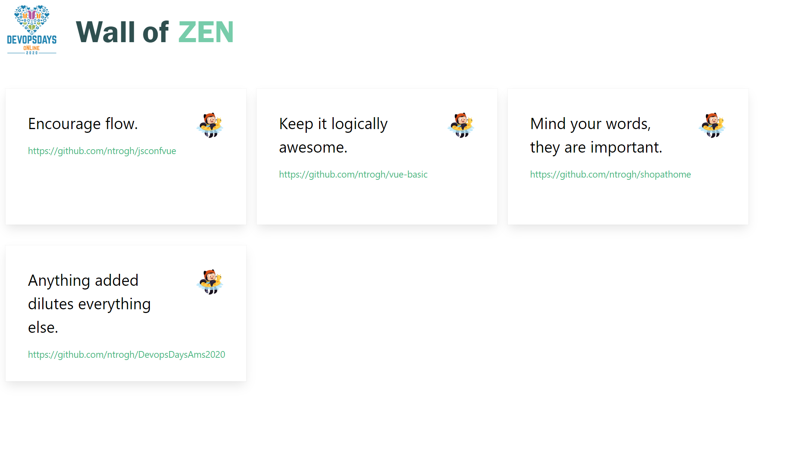

# Devopsdays Amsterdam 2020: GitHub Actions coding challenge (Wall of Zen)

GitHub Actions is all the craze and to get you up to speed, we have created a series of **5 short coding challenges**. You will have to create a GitHub Actions workflow to set up a CI/CD pipeline for a Docker-based Node.js application.

Thanks for participating in this coding challenge and keep learning! We have an extensive set of [free learning modules on how to automate using GitHub Actions](https://docs.microsoft.com/en-us/learn/paths/automate-workflow-github-actions/?ocid=aid3016779) - highly recommended!!

*Are you ready to show off your GitHub Actions skills?*


## What's this Wall of Zen?

We have created a [Wall of Zen page](https://aka.ms/wallofzen) where you can post Zen quotes for the Devopsdays attendees. Under the hood it uses the [Octocat GitHub API](https://api.github.com/octocat).




The sample Node.js application in this repo exposes a REST API to add a zen quote to this Wall of Zen. The goal of the coding challenges is to setup a CI/CD pipeline to deploy this Node.js application, and then invoke it's API, all from your GitHub Actions workflow.

You can check our [Getting started](./GettingStarted.md) guide to learn how to run the application locally.


## Submit your solutions? 🔥

You can find the detailed instructions in our [Contributing.md](Contributing.md) guidelines, but here's the TL;DR.

* Submit your final solution as a new [Challenge Solution Submission ISSUE](https://github.com/GitHub-Coding-Challenge/devopsdaysams-actions/issues/new/choose) to this GitHub repository.

We'd love it if you also **share your experience on social media**! You can use the **#DevopsWallofZen** Twitter hashtag to do so.


## Challenge 1: adding a GitHub Actions workflow to your repository

To get started, you will have to create a GitHub Actions workflow to your repository that will be triggered as soon as code is pushed to the main branch. We will be building on top of this workflow in the follow-on challenges. Check out the [Getting Started Guide for GitHub Actions](https://docs.github.com/en/actions/getting-started-with-github-actions?ocid=aid3016779).

To complete this first coding challenge, you will have to:

1. **Fork** this repo as a public repo in your GitHub account
2. **Create a GitHub Actions workflow** in your repo that:
    - is triggered upon a push to the main branch
    - writes out the full url of your GitHub repo in the log file


## Challenge 2: building a docker image and publishing it

Now that you have a GitHub Actions workflow up and running, which is triggered each time you push code to your main branch, the next step is to checkout the source code and create a Docker image for. Have a look at the [GitHub Actions marketplace](https://github.com/marketplace?type=actions?ocid=aid3016779) for community actions that you can leverage.

The sample application is a Node.js application that exposes a REST API (http://localhost/addtowall) to post a random zen quote on our [Wall of Zen](https://aka.ms/wallofzen). 

To complete this second coding challenge, you need to configure the GitHub Actions workflow to:

1. **Checkout** the sources of the sample application
2. **Builds** a docker images for the sample application
3. **Publishes** the docker image to a container registry (e.g. Azure Container Registry or Docker Hub)

> **Important**: Make sure not to store your registry credentials in your workflow file! You may want to take a look at [this article](https://docs.github.com/en/actions/configuring-and-managing-workflows/using-variables-and-secrets-in-a-workflow?ocid=aid3016779) to find out how to work with secrets.


## Challenge 3: deploying the container image to Azure Container Instances

With the Docker image available in the container registry, you can now deploy to have a running instance of the application. In this coding challenge we will be using [Azure Container Instances](https://docs.microsoft.com/en-us/azure/container-instances/container-instances-overview?ocid=aid3016779) (ACI). ACI allows you to easily deploy a container without having to worry about the underlaying infrastructure and just pay for the requests that it processes. At the end of this challenge, you will have a public-facing endpoint for the Node.js REST API.

GitHub Actions workflow can run multiple jobs in parallel and also have dependencies between jobs. In this challenge you will put the deployment phase of the entire CI/CD pipeline in a separate job. As this 'deployment' job can only run when the 'build' job has completed, you will need to define a dependency between both jobs.

Check the [GitHub Actions for Azure](https://azure.microsoft.com/en-us/blog/github-actions-for-azure-is-now-generally-available/?ocid=aid3016779) to find out how to connect to Azure from within your workflow.

To complete the third challenge, you will further evolve the GitHub Actions workflow to:

1. Add a **second job** to the workflow - make sure it only runs when the first job has completed
2. **Deploy** the Docker image from the container registry on an **Azure Container Instance** (ACI)

> **Note**: The application expects the ```BASE_URL``` environment variable to be set. Make sure to pass this information onto the Azure Container Instance.

```shell
BASE_URL=https://devopsdaysams.azurewebsites.net/api/AddToWall
```


## Challenge 4: invoke the API to post a quote on the Wall of Zen

With the Node.js REST API up-and-running, what's left is to invoke the REST API from within your workflow. Invoking the API is a matter of calling an HTTP GET on a given method. You can find several community actions in the [GitHub Actions marketplace](https://github.com/marketplace?type=actions?ocid=aid3016779) that can achieve this.

The URL of the API running on ACI is structured as follows: **http://myaci.westeurope.azurecontainer.io:80/addtowall?repoUrl=https://github.com/myorg/myrepo**. You will need to construct this URL based on output from the ACI deployment step, and the current GitHub repository name.

> Note that the API will only post one zen quote per GitHub repository on the Wall of Zen.

To complete this fourth challenge, you will update the workflow to:

1. **Construct the URL** for the API deployed in your Azure Container Instance. The format of the URL is **"{ACI host}addtowall?repoUrl={your GitHub repository url}"**
2. **Invoke the URL** to post your zen quote on the Wall of Zen

You have now completed all main challenges to have your Zen quote posted on the [Wall of Zen](https://aka.ms/wallofzen).


## BONUS Challenge: send a tweet when your workflow completes successfully

Now that you have the entire CI/CD pipeline completed, it's time to brag about it! In this bonus challenge you can use one of the community GitHub actions to send a tweet with your zen quote. When invoking the REST API in challenge 4, make sure to use a community action that provides the output of the call as an output parameter. 

The output of the REST API is a JSON document. You can grab the ```quote``` field to get the actual zen quote.

```json
{ 
    "quote": "Encourage flow.", 
    "octocat_quote": "
               MMM.           .MMM
               MMMMMMMMMMMMMMMMMMM
               MMMMMMMMMMMMMMMMMMM      ____________________________
              MMMMMMMMMMMMMMMMMMMMM    |                            |
             MMMMMMMMMMMMMMMMMMMMMMM   | Favor focus over features. |
            MMMMMMMMMMMMMMMMMMMMMMMM   |_   ________________________|
            MMMM::- -:::::::- -::MMMM    |/
             MM~:~ 00~:::::~ 00~:~MM
        .. MMMMM::.00:::+:::.00::MMMMM ..
              .MM::::: ._. :::::MM.
                 MMMM;:::::;MMMM
          -MM        MMMMMMM
          ^  M+     MMMMMMMMM
              MMMMMMM MM MM MM
                   MM MM MM MM
                   MM MM MM MM
                .~~MM~MM~MM~MM~~.
             ~~~~MM:~MM~~~MM~:MM~~~~
            ~~~~~~==~==~~~==~==~~~~~~
             ~~~~~~==~==~==~==~~~~~~
                 :~==~==~==~==~~
        "
}
```

To complete this final bonus challenge, you can now finalize your GitHub Actions workflow to:

1. **Retrieve the quote text** from the API you invoked in challenge 4
2. **Send out a tweet** with this quote and using the #DevopsWallofZen hashtag!


## Suggested resources 🚀

* [Visual Studio Code](https://code.visualstudio.com?ocid=aid3016779)
* Azure Subscription: [Sign up](https://azure.microsoft.com/en-us/free/?ocid=aid3016779) for a free Azure account
* [GitHub Actions Getting Started](https://docs.github.com/en/actions/getting-started-with-github-actions?ocid=aid3016779)
* [GitHub Actions for deploying to Azure](https://github.com/Azure/actions?ocid=aid3016779)


## Contributing 🚩

This project welcomes contributions and suggestions. Most contributions require you to agree to a Contributor License Agreement (CLA) declaring that you have the right to, and actually do, grant us the rights to use your contribution. For details, visit https://cla.opensource.microsoft.com.

When you submit a pull request, a CLA bot will automatically determine whether you need to provide a CLA and decorate the PR appropriately (e.g., status check, comment). Simply follow the instructions provided by the bot. You will only need to do this once across all repos using our CLA.

This project has adopted the [Microsoft Open Source Code of Conduct](https://opensource.microsoft.com/codeofconduct/). For more information see the [Code of Conduct FAQ](https://opensource.microsoft.com/codeofconduct/faq/) or contact [opencode@microsoft.com](mailto:opencode@microsoft.com) with any additional questions or comments.
